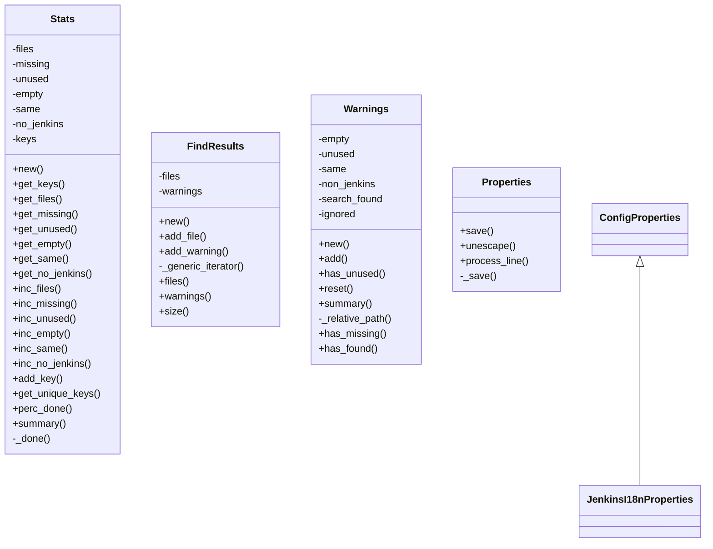

# Classes diagram

These are the classes in use by `jtt`.

Before jumping into it, please consider that:

- Perl doesn't have the concept of private methods, but `-` is there just to visualize that.
- `ConfigProperties` stands for `Config::Properties`, which is available at CPAN.

