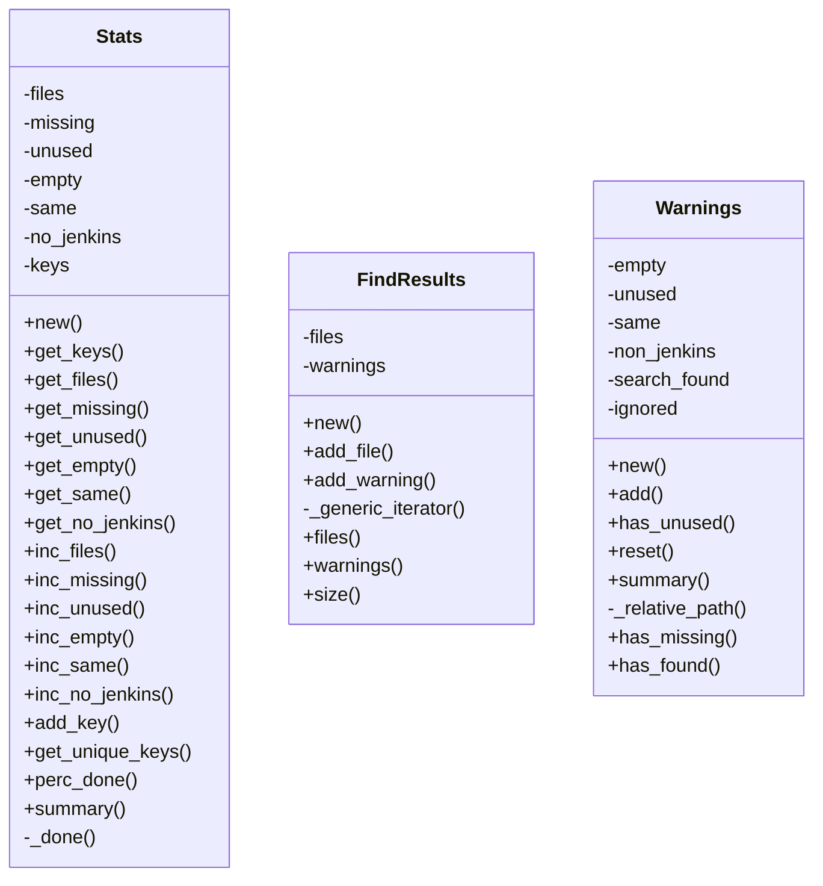

# Classes diagram

```mermaid
classDiagram
class Stats {
  -files
  -missing
  -unused
  -empty
  -same
  -no_jenkins
  -keys
  +new()
  +get_keys()
  +get_files()
  +get_missing()
  +get_unused()
  +get_empty()
  +get_same()
  +get_no_jenkins()
  +inc_files()
  +inc_missing()
  +inc_unused()
  +inc_empty()
  +inc_same()
  +inc_no_jenkins()
  +add_key()
  +get_unique_keys()
  +perc_done()
  +summary()
  -_done()
}
class FindResults {
  -files
  -warnings
  +new()
  +add_file()
  +add_warning()
  -_generic_iterator()
  +files()
  +warnings()
  +size()
}
class Warnings {
  -empty
  -unused
  -same
  -non_jenkins
  -search_found
  -ignored
  +new()
  +add()
  +has_unused()
  +reset()
  +summary()
  -_relative_path()
  +has_missing()
  +has_found()
}
```
